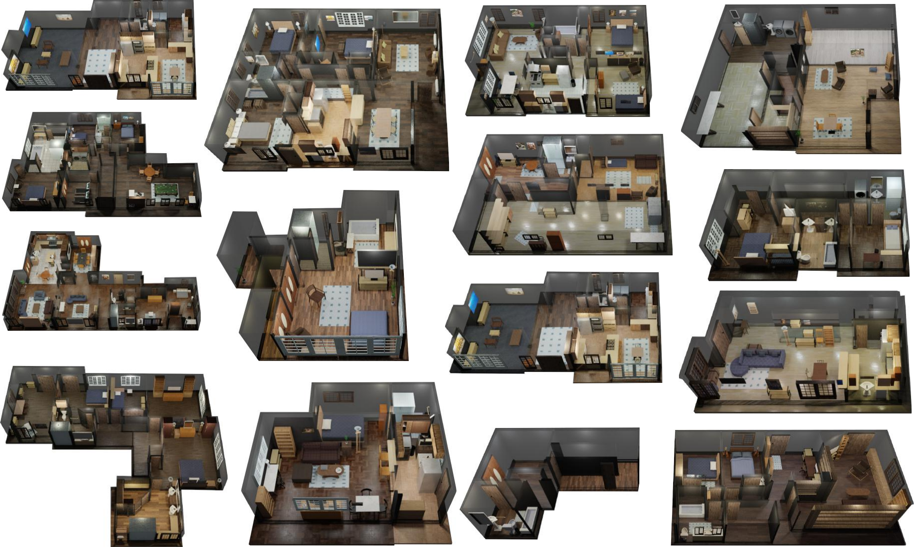

Dataset
==========================================

In dataset we include two parts. First we introduce the new iGibson dataset in this release. Secondly, we introduce
 how to download previous Gibson dataset, which is updated and compatible with iGibson.

- [Download iGibson Data](#download-igibson-data)
- [Download Gibson Data](#download-gibson-data)

Download iGibson Data
------------------------

We annotate fifteen 3D reconstructions of real-world scans and convert them into fully interactive scene models. In this process, we respect the original object-instance layout and object-category distribution. The object models are extended from open-source datasets ([ShapeNet Dataset](https://www.shapenet.org/), [Motion Dataset](http://motiondataset.zbuaa.com/), [SAPIEN Dataset](https://sapien.ucsd.edu/)) enriched with annotations of material and dynamic properties. 

The fifteen fully interactive models are visualized below. 



#### Download Instruction
To download the dataset, you need to first configure where the dataset is to be stored. You can change it in `your_installation_path/gibson2/global_config.yaml` (default and recommended: `ig_dataset: your_installation_path/gibson2/data/ig_dataset`). iGibson scenes can be downloaded with one single line:

```bash
python -m gibson2.utils.assets_utils --download_ig_dataset
```

#### Dataset Format
The new dataset format can be found [here](https://github.com/StanfordVL/iGibson/tree/master/gibson2/utils/data_utils). 

#### Cubicasa / 3D Front Dataset
We provide support for Cubicasa and 3D Front Dataset, to import them into iGibson, follow the guide [here](https://github.com/StanfordVL/iGibson/tree/master/gibson2/utils/data_utils/ext_scene). 

Download Gibson Data
------------------------
Original Gibson Environment Dataset has been updated to use with iGibson simulator. The link will first take you to
 the license agreement and then to the data. 

<a href="https://forms.gle/36TW9uVpjrE1Mkf9A" target="_blank">[[ Get download link for Gibson Data ]]</a>.

License Note: The dataset license is included in the above link. The license in this repository covers only the provided software.

Files included in this distribution:

1. All scenes, 572 scenes (108GB): gibson_v2_all.tar.gz
2. 4+ partition, 106 scenes, with textures better packed (2.6GB): gibson_v2_4+.tar.gz
3. Demo scene `Rs`

To download 1 and 2, you need to fill in the agreement and get the download link `URL`, after which you can
 manually download and store them in the path set in `your_installation_path/gibson2/global_config.yaml` (default and
  recommended: `dataset: your_installation_path/gibson2/data/g_dataset`). You can run a single command to download the dataset
  , this script automatically download, decompress, and put the dataset to correct place.
```bash
python -m gibson2.utils.assets_utils --download_dataset URL
```

To download 3, you can run:

```bash
python -m gibson2.utils.assets_utils --download_demo_data
```


### Original Gibson Environment Dataset Description (Non-interactive)


Full Gibson Environment Dataset consists of 572 models and 1440 floors. We cover a diverse set of models including households, offices, hotels, venues, museums, hospitals, construction sites, etc. A diverse set of visualization of all spaces in Gibson can be seen [here](http://gibsonenv.stanford.edu/database/).
 


#### Dataset Metadata

Each space in the database has some metadata with the following attributes associated with it. The metadata is available in this [JSON file](https://raw.githubusercontent.com/StanfordVL/GibsonEnv/master/gibson/data/data.json). 
```
id                      # the name of the space, e.g. ""Albertville""
area                    # total metric area of the building, e.g. "266.125" sq. meters
floor                   # number of floors in the space, e.g. "4"
navigation_complexity   # navigation complexity metric, e.g. "3.737" (see the paper for definition)
room                    # number of rooms, e.g. "16"
ssa                     # Specific Surface Area (A measure of clutter), e.g. "1.297" (see the paper for definition)
split_full              # if the space is in train/val/test/none split of Full partition 
split_full+             # if the space is in train/val/test/none split of Full+ partition 
split_medium            # if the space is in train/val/test/none split of Medium partition 
split_tiny              # if the space is in train/val/test/none split of Tiny partition 
```

#### Dataset Format

Each space in the database has its own folder. All the modalities and metadata for each space are contained in that folder. 
```
mesh_z_up.obj             # 3d mesh of the environment, it is also associated with an mtl file and a texture file, omitted here
floors.txt                # floor height
floor_render_{}.png       # top down views of each floor
floor_{}.png              # top down views of obstacles for each floor
floor_trav_{}.png         # top down views of traversable areas for each floor  
```

For the maps, each pixel represents 0.01m, and the center of the image correspond to `(0,0)` in the mesh, as well as in the pybullet coordinate system. 

#### Dataset Metrics


**Floor Number** Total number of floors in each model.

We calculate floor numbers using distinctive camera locations. We use `sklearn.cluster.DBSCAN` to cluster these locations by height and set minimum cluster size to `5`. This means areas with at least `5` sweeps are treated as one single floor. This helps us capture small building spaces such as backyard, attics, basements.

**Area** Total floor area of each model.

We calculate total floor area by summing up area of each floor. This is done by sampling point cloud locations based on floor height, and fitting a `scipy.spatial.ConvexHull` on sample locations.

**SSA** Specific surface area. 

The ratio of inner mesh surface and volume of convex hull of the mesh. This is a measure of clutter in the models: if the inner space is placed with large number of furnitures, objects, etc, the model will have high SSA. 

**Navigation Complexity** The highest complexity of navigating between arbitrary points within the model.

We sample arbitrary point pairs inside the model, and calculate `A∗` navigation distance between them. `Navigation Complexity` is equal to `A*` distance divide by `straight line distance` between the two points. We compute the highest navigation complexity for every model. Note that all point pairs are sample within the *same floor*.

**Subjective Attributes**

We examine each model manually, and note the subjective attributes of them. This includes their furnishing style, house shapes, whether they have long stairs, etc.

