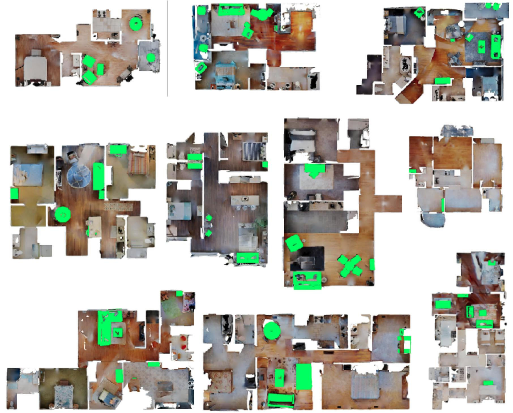

Dataset
==========================================

Download Gibson Data
------------------------

The link will first take you to the license agreement and then to the data.

[[ Get download link for Gibson Data ]](https://goo.gl/forms/OxAQHbl1v97BJ3Sg1)  

License Note: The dataset license is included in the above link. The license in this repository covers only the provided software.

Files included in this distribution:

- All scenes, 572 scenes (108GB): gibson_v2_all.tar.gz
- 4+ partition, 106 Scenes, with textures better packed (2.6GB): gibson_v2_4+.tar.gz
- Gibson V2 environments with interactive objects, 10 Scenes (<1GB): interactive_dataset.tar.gz
- Demo scenes, `Rs` and `Rs_interactive`


New Interactive Gibson Environment Dataset
--------------------------------------------------

Using a semi-automatic pipeline introduced in our [ICRA20 paper](https://ieeexplore.ieee.org/document/8954627), we annotated for five object categories (chairs, desks, doors, sofas, and tables) in ten buildings (more coming soon!)

Replaced objects are visualized in these topdown views:



#### Dataset Format

The dataset format is similar to original gibson dataset, with additional of cleaned scene mesh, floor plane and replaced objects. Files in one folder are listed as below:

```
mesh_z_up.obj               # 3d mesh of the environment, it is also associated with an mtl file and a texture file, omitted here
mesh_z_up_cleaned.obj       # 3d mesh of the environment, with annotated furnitures removed
alignment_centered_{}.urdf  # replaced furniture models as urdf files
pos_{}.txt                  # xyz position to load above urdf models
floors.txt                  # floor height
plane_z_up_{}.obj           # floor plane for each floor, used for filling holes
floor_render_{}.png         # top down views of each floor
floor_{}.png                # top down views of obstacles for each floor
floor_trav_{}.png           # top down views of traversable areas for each floor  
```

Original Gibson Environment Dataset (Non-interactive)
-------------------------------------------------------

Original Gibson Environment Dataset has been updated to use with iGibson simulator.

Full Gibson Environment Dataset consists of 572 models and 1440 floors. We cover a diverse set of models including households, offices, hotels, venues, museums, hospitals, construction sites, etc. A diverse set of visualization of all spaces in Gibson can be seen [here](http://gibsonenv.stanford.edu/database/).
 


#### Dataset Metadata

Each space in the database has some metadata with the following attributes associated with it. The metadata is available in this [JSON file](https://raw.githubusercontent.com/StanfordVL/GibsonEnv/master/gibson/data/data.json). 
```
id                      # the name of the space, e.g. ""Albertville""
area                    # total metric area of the building, e.g. "266.125" sq. meters
floor                   # number of floors in the space, e.g. "4"
navigation_complexity   # navigation complexity metric, e.g. "3.737" (see the paper for definition)
room                    # number of rooms, e.g. "16"
ssa                     # Specific Surface Area (A measure of clutter), e.g. "1.297" (see the paper for definition)
split_full              # if the space is in train/val/test/none split of Full partition 
split_full+             # if the space is in train/val/test/none split of Full+ partition 
split_medium            # if the space is in train/val/test/none split of Medium partition 
split_tiny              # if the space is in train/val/test/none split of Tiny partition 
```

#### Dataset Format

Each space in the database has its own folder. All the modalities and metadata for each space are contained in that folder. 
```
mesh_z_up.obj             # 3d mesh of the environment, it is also associated with an mtl file and a texture file, omitted here
floors.txt                # floor height
floor_render_{}.png       # top down views of each floor
floor_{}.png              # top down views of obstacles for each floor
floor_trav_{}.png         # top down views of traversable areas for each floor  
```

For the maps, each pixel represents 0.01m, and the center of the image correspond to `(0,0)` in the mesh, as well as in the pybullet coordinate system. 

#### Dataset Metrics


**Floor Number** Total number of floors in each model.

We calculate floor numbers using distinctive camera locations. We use `sklearn.cluster.DBSCAN` to cluster these locations by height and set minimum cluster size to `5`. This means areas with at least `5` sweeps are treated as one single floor. This helps us capture small building spaces such as backyard, attics, basements.

**Area** Total floor area of each model.

We calculate total floor area by summing up area of each floor. This is done by sampling point cloud locations based on floor height, and fitting a `scipy.spatial.ConvexHull` on sample locations.

**SSA** Specific surface area. 

The ratio of inner mesh surface and volume of convex hull of the mesh. This is a measure of clutter in the models: if the inner space is placed with large number of furnitures, objects, etc, the model will have high SSA. 

**Navigation Complexity** The highest complexity of navigating between arbitrary points within the model.

We sample arbitrary point pairs inside the model, and calculate `A∗` navigation distance between them. `Navigation Complexity` is equal to `A*` distance divide by `straight line distance` between the two points. We compute the highest navigation complexity for every model. Note that all point pairs are sample within the *same floor*.

**Subjective Attributes**

We examine each model manually, and note the subjective attributes of them. This includes their furnishing style, house shapes, whether they have long stairs, etc.

