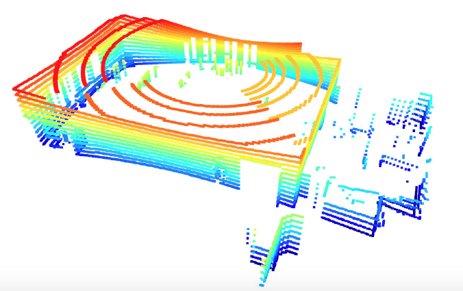

# Renderer

### Overview

We developed our own MeshRenderer that supports customizable camera configuration and various image modalities, and renders at a lightening speed. Specifically, you can specify image width, height and vertical field of view in the constructor of `class MeshRenderer`. Then you can call `renderer.render(modes=('rgb', 'normal', 'seg', '3d', 'optical_flow', 'scene_flow'))` to retrieve the images. Currently we support six different image modalities: RGB, surface normal, segmentation, 3D point cloud (z-channel can be extracted as depth map), optical flow, and scene flow. We also support two types of LiDAR sensors: 1-beam and 16-beam (like Velodyne VLP-16). Most of the code can be found in [gibson2/render](https://github.com/StanfordVL/iGibson/tree/master/gibson2/render).

### Examples

#### Simple Example

In this example, we render an iGibson scene with a few lines of code. The code can be found in [examples/demo/mesh_renderer_simple_example.py](https://github.com/StanfordVL/iGibson/blob/master/examples/demo/mesh_renderer_simple_example.py).

```
import cv2
import sys
import os
import numpy as np
from gibson2.render.mesh_renderer.mesh_renderer_cpu import MeshRenderer
from gibson2.utils.assets_utils import get_scene_path


def main():
    if len(sys.argv) > 1:
        model_path = sys.argv[1]
    else:
        model_path = os.path.join(get_scene_path('Rs'), 'mesh_z_up.obj')

    renderer = MeshRenderer(width=512, height=512)
    renderer.load_object(model_path)
    renderer.add_instance(0)
    camera_pose = np.array([0, 0, 1.2])
    view_direction = np.array([1, 0, 0])
    renderer.set_camera(camera_pose, camera_pose + view_direction, [0, 0, 1])
    renderer.set_fov(90)
    frames = renderer.render(
        modes=('rgb', 'normal', '3d'))
    frames = cv2.cvtColor(np.concatenate(frames, axis=1), cv2.COLOR_RGB2BGR)
    cv2.imshow('image', frames)
    cv2.waitKey(0)


if __name__ == '__main__':
    main()
```

For `Rs` scene, the rendering results will look like this:


#### Interactive Example

In this example, we show an interactive demo of MeshRenderer.

```bash
cd examples/demo
python mesh_renderer_example.py
```
You may translate the camera by pressing "WASD" on your keyboard and rotate the camera by dragging your mouse. Press `Q` to exit the rendering loop. The code can be found in [examples/demo/mesh_renderer_example.py](https://github.com/StanfordVL/iGibson/blob/master/examples/demo/mesh_renderer_example.py).

#### PBR (Physics-Based Rendering) Example

`TODO: @fei fix mesh_renderer_example_pbr.py`

#### Velodyne VLP-16 Example
In this example, we show a demo of 16-beam Velodyne VLP-16 LiDAR placed on top of a virtual Turtlebot. The code can be found in [examples/demo/lidar_velodyne_example.py](https://github.com/StanfordVL/iGibson/blob/master/examples/demo/lidar_velodyne_example.py).
`TODO @fei add Velodyne LiDAR visualization to lidar_velodyne_example.py`

The Velodyne VLP-16 LiDAR visualization will look like this:


#### Render to PyTorch Tensors

In this example, we show that MeshRenderer can directly render into a PyTorch tensor to maximize efficiency. PyTorch installation is required (otherwise, iGibson does not depend on PyTorch). The code can be found in [examples/demo/mesh_renderer_gpu_example.py](https://github.com/StanfordVL/iGibson/blob/master/examples/demo/mesh_renderer_gpu_example.py).

