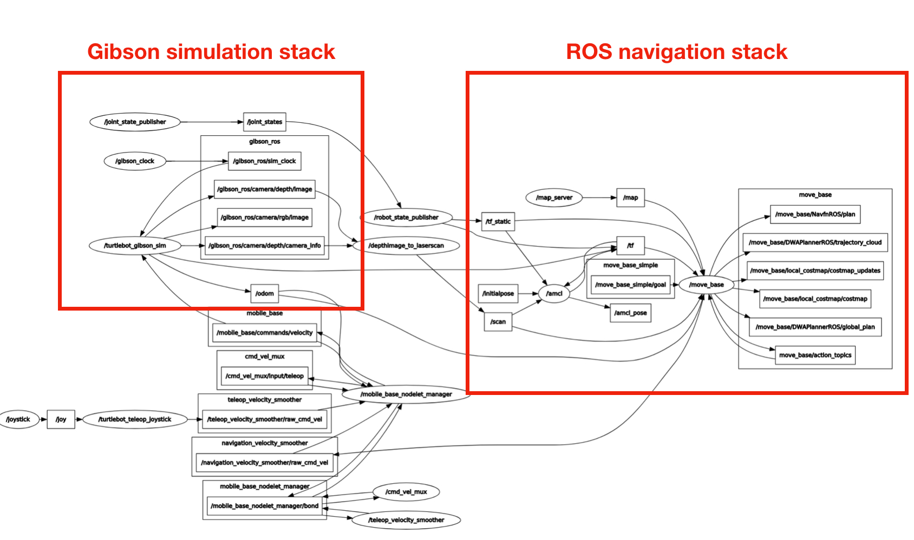
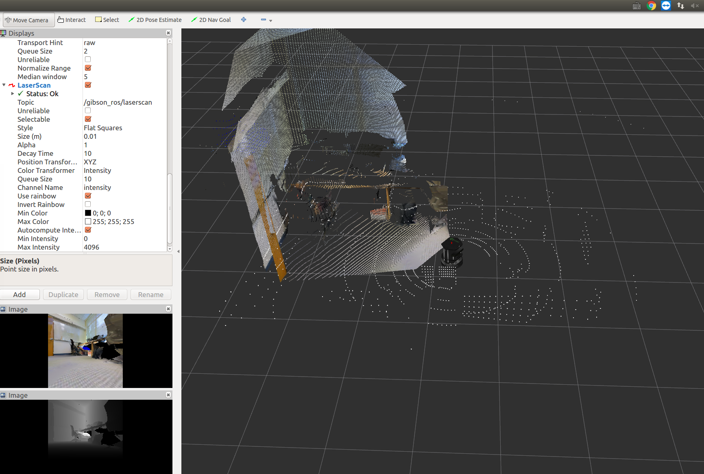
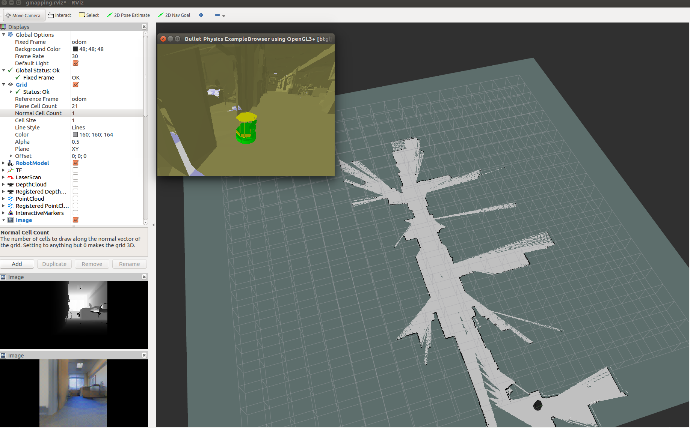

ROS Integration
============

Introduction
----------------

[ROS](http://www.ros.org) is a set of well-engineered software libraries for building robotics applications. It includes a wide variety of packages, from low level drivers to efficient implementations of state of the art algorithms. As we strive to build intelligent agents and transfer them to real-world (on a real robot), we need to take advantage of ROS packages to complete the robot application pipeline. 

There are three key applications of integrating iGibson with ROS. 

- Benchmark existing algorithms in a controlled realistic simulation environment. This allows for comparing learning-based methods with classical methods in simulation environments.
- Comparing robots in simulation with robots in the real world. In simulation, iGibson can simulate sensors of a robot and publish as messages. In the real world, a real robot publish sensor messages from onboard sensors. Therefore, it is possible to only change the message subscribed and benchmark the performance of downstream applications. This helps locate domain gap and debug algorithms.
- Using ROS functions in simulation, such as many motion planning implementations.

The possibility of using iGibson with ROS is unlimited. As a starter, we provide an example of integrating iGibson with ROS for navigation. This is a ROS package integrates iGibson Env with ROS navigation stack. It follows the same node topology and topics as `turtlebot_navigation` package. As shown below, so after a policy is trained in iGibson, it requires minimal changes to deploy onto a real turtlebot.



Environment Setup
----------------

## Preparation
 
1. Install ROS: in this package, we use navigation stack from ROS kinetic. Please follow the [instructions](http://wiki.ros.org/kinetic/Installation/Ubuntu).
2. Install iGibson **from source** following [installation guide](installation.md) in **python2.7**. Note that ROS only supports `python2.7` at the moment, so you need to create python2.7 virtual environment to install iGibson instead of python3.x.
3. If you use anaconda for setting up python environment, some tweaks of `PATH` and `PYTHONPATH` variable are required to avoid conflict. In particular:
	1. For `PATH`: conda related needs to be removed from `PATH`
	```bash
	echo $PATH | grep -oP "[^:;]+" | grep conda	## Remove these paths from $PATH
	```
	2. For `PYTHONPATH`: `/usr/lib/python2.7/dist-packages/`, `/opt/ros/kinetic/lib/python2.7/dist-packages`(ROS python libraries), `<anaconda installation root>/envs/py27/lib/python2.7/site-packages`(iGibson dependencies) and `<iGibson root>` need to be in `PYTHONPATH` **in this exact order**.
4. Create `catkin_ws` folder
```bash
mkdir -p ~/catkin_ws
```
5. Soft-link `gibson-ros` folder to your `catkin_ws/src` and run catkin_make to index gibson-ros package.
```bash
cd <iGibson root>/gibson2
ln -s $PWD/examples/ros/gibson-ros/ ~/catkin_ws/src/
cd ~/catkin_ws && catkin_make
```
5. Install `gibson2-ros` dependencies:
```bash
cd ~/catkin_ws
rosdep install --from-paths src --ignore-src -r -y
```

## Sanity check 

```bash
which python # Should give /usr/bin/python
python -c 'import gibson2, rospy, rospkg' # Should run without errors.
```

Running
----------------

In order to run iGibson+ROS examples, you will need to perform the following steps:

1. Prepare ROS environment
```bash
source /opt/ros/kinetic/setup.bash
source ~/catkin_ws/devel/setup.bash
```
2. Repeat step 3 from Preparation, sanitize `PATH` and `PYTHONPATH`
3. Here are some of the examples that you can run, including gmapping, hector mapping and navigation.
```bash
roslaunch gibson2-ros turtlebot_rgbd.launch # Bare minimal bringup example
roslaunch gibson2-ros turtlebot_gmapping.launch # Run gmapping
roslaunch gibson2-ros turtlebot_hector_mapping.launch # Run hector mapping
roslaunch gibson2-ros turtlebot_navigation.launch # Run the navigation stack, we have provided the map
roslaunch gibson2-ros turtlebot_gt_navigation.launch # Run the navigation stack with ground truth localization
```


The following screenshot is captured when running the bare minimal bringup example.



The following screenshot is captured when running the gmapping example.




Topics
----------------

Here are all the topics that `turtlebot_rgbd.py` publishes and subscribes.
- `turtlebot_rgbd.py`

Publishes:

| Topic name        | Type           | Usage|
|:------------------:|:---------------------------:|:---:|
|`/gibson_ros/camera/depth/camera_info`|`sensor_msgs/CameraInfo`|Camera parameters used in iGibson, same for depth and rgb|
|`/gibson_ros/camera/rgb/image`|`sensor_msgs/Image`|RGB image captured in iGibson|
|`/gibson_ros/camera/rgb/depth`|`sensor_msgs/Image`|Depth image captured in iGibson, in meters, with dtype being float32|
|`/gibson_ros/camera/rgb/depth_raw`|`sensor_msgs/Image`|Depth image captured in iGibson, mimic raw depth data captured with OpenNI cameras, with dtype being uint16, see more [here](http://www.ros.org/reps/rep-0118.html)|
|`/gibson_ros/lidar/points`|`sensor_msgs/PointCloud2`|1-beam LiDAR scan captured in iGibson, in meters, with dtype being float32|
|`/odom`|`nav_msgs/Odometry` |The pose of `base_footprint` in `odom` frame, generated with groudtruth pose in iGibson|
|`/ground_truth_odom`|`nav_msgs/Odometry`|The pose of `base_footprint` in `world` frame, generated with groudtruth pose in iGibson|

Subscribes:

| Topic name        | Type           | Usage|
|:------------------:|:---------------------------:|:---:|
|`/mobile_base/commands/velocity`|`geometry_msgs/Twist`|Velocity command for turtlebot, `msg.linear.x` is the forward velocity, `msg.angular.z` is the angular velocity|
|`reset_pose`|`geometry_msgs/PoseStamped`|Direct reset turtlebot's pose (i.e. teleportation)|


### References

- [Turtlebot Navigation stack](http://wiki.ros.org/turtlebot_navigation/Tutorials/Setup%20the%20Navigation%20Stack%20for%20TurtleBot)
- [`Move_base` package](http://wiki.ros.org/move_base)
