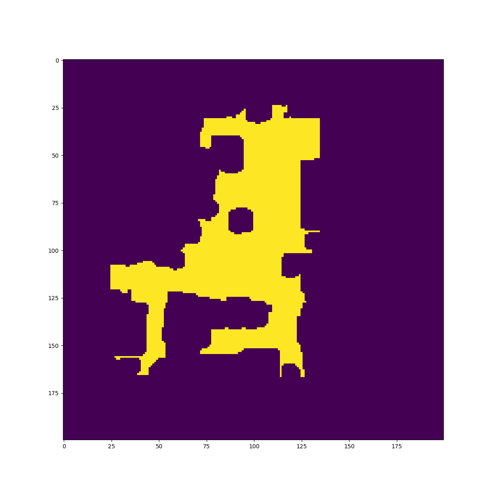

# Scenes

### Overview
We provide three types of scenes.
- `EmptyScene` and `StadiumScene`: they are simple scenes with flat grounds and no obstacles, very good for debugging.
- `BuildingScene`: it loads most of the realistic 3D scenes from `gibson2.dataset_path`.

To be more specific, `BuildingScene`
- stores the floor information (we have many multistory houses in our dataset)
- loads the scene mesh into PyBullet
- builds an internal traversability graph for each floor based on the traversability maps stored in the scene folder (e.g. `dataset/Rs/floor_trav_0.png`)
- loads the scene objects and places them in their original locations if the scene is interactive
- provides APIs for sampling a random location in the scene, and for computing the shortest path between two locations in the scene.

Most of the code can be found here: [gibson2/core/physics/scene.py](https://github.com/StanfordVL/iGibson/blob/master/gibson2/core/physics/scene.py).

### Examples

#### Stadium Scenes

In this example, we import a simple stadium scene that is good for debugging. The code can be found here: [examples/demo/scene_stadium_example.py](https://github.com/StanfordVL/iGibson/blob/master/examples/demo/scene_stadium_example.py).

```python
from gibson2.core.physics.scene import StadiumScene
import pybullet as p
import numpy as np
import time

def main():
    p.connect(p.GUI)
    p.setGravity(0,0,-9.8)
    p.setTimeStep(1./240.)

    scene = StadiumScene()
    scene.load()

    for _ in range(24000):  # at least 100 seconds
        p.stepSimulation()
        time.sleep(1./240.)

    p.disconnect()


if __name__ == '__main__':
    main()
```

The stadium scene looks like this:


#### Static Building Scenes

In this example, we import a static scene, and then randomly sample a pair of locations in the scene and compuete the shortest path between them. The code can be found here: [examples/demo/scene_example.py](https://github.com/StanfordVL/iGibson/blob/master/examples/demo/scene_example.py).

```python
from gibson2.core.physics.scene import BuildingScene
import pybullet as p
import numpy as np
import time

def main():
    p.connect(p.GUI)
    p.setGravity(0,0,-9.8)
    p.setTimeStep(1./240.)

    scene = BuildingScene('Rs',
                          build_graph=True,
                          pybullet_load_texture=True)
    scene.load()

    np.random.seed(0)
    for _ in range(10):
        random_floor = scene.get_random_floor()
        p1 = scene.get_random_point_floor(random_floor)[1]
        p2 = scene.get_random_point_floor(random_floor)[1]
        shortest_path, geodesic_distance = scene.get_shortest_path(random_floor, p1[:2], p2[:2], entire_path=True)
        print('random point 1:', p1)
        print('random point 2:', p2)
        print('geodesic distance between p1 and p2', geodesic_distance)
        print('shortest path from p1 to p2:', shortest_path)

    for _ in range(24000):  # at least 100 seconds
        p.stepSimulation()
        time.sleep(1./240.)

    p.disconnect()


if __name__ == '__main__':
    main()
```

#### Interactive Building Scenes

In this example, we import an interactive scene. We support ten such scenes right now (the list can be found in `dataset/gibson_list`). All you need to do is to turn on the flag `is_interactive=True` when you initialize `BuildingScene`. The code can be found here: [examples/demo/scene_interactive_example.py](https://github.com/StanfordVL/iGibson/blob/master/examples/demo/scene_interactive_example.py).

The interactive scene will replace the annotated objects with very similar CAD models with their original texture, aligned to their original poses. Because removing the annotated objects will inevitably create holes on the floor, we add additional floor planes with the original floor texture as well.

For example, in the scene `Placida` below, the couches, the coffee table, the dining table and the dining chairs are all interactive objects.


#### Visualize Traversability Map

In this example, we visuliaze the traversability map of a scene. We use this map to build an internal traversability graph for each floor so that we can compute the shortest path between two locations, and place robots and objects at valid locations inside the scene. The code can be found here: [examples/demo/trav_map_vis_example.py](https://github.com/StanfordVL/iGibson/blob/master/examples/trav_map_vis_example.py).

The traversability map of the scene `Rs` looks like this:


